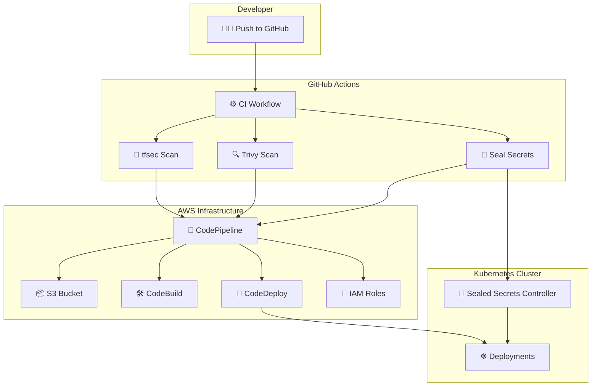

# 🚀 Secure CI/CD Pipeline on AWS using Terraform, GitHub Actions & Sealed Secrets

This repository provides a comprehensive blueprint for building secure, automated, and efficient CI/CD pipelines. It leverages Terraform to provision a complete AWS CodePipeline stack (deploying to EC2) and demonstrates a modern DevSecOps workflow using GitHub Actions to scan, test, and deploy containerized applications to Kubernetes, featuring secure secret management with Kubernetes Sealed Secrets.

The project is designed to be a one-stop solution for DevOps professionals looking to implement Infrastructure as Code (IaC), robust security scanning, and automated deployment practices.

---

## 🧱 Modern DevSecOps Architecture Overview




## 🔑 Key Highlights

- **Infrastructure as Code (IaC)**: All AWS resources (CodePipeline, EC2, S3, IAM) are fully provisioned and managed by Terraform.
- **Automated Security Gates**: Integrates tfsec for static analysis of Terraform code and Trivy for scanning Docker images for vulnerabilities right within the CI pipeline.
- **Dual Deployment Strategy**: Supports both traditional deployments to AWS EC2 via CodeDeploy and modern containerized deployments to Kubernetes.
- **End-to-End Automation**: CI/CD workflows are triggered automatically on every git push, providing rapid feedback and deployment.
- **Encrypted Secret Management**: Employs Kubernetes Sealed Secrets to safely store and manage sensitive information like database passwords and API keys in a Git repository.
- **Infrastructure Validation**: Includes Terratest for writing automated Go tests to validate the correctness of the Terraform infrastructure.

---

## 🧰 Tools & Technologies

| Layer            | Tools/Services                                           |
|------------------|----------------------------------------------------------|
| IaC              | Terraform, Terratest                                     |
| Cloud Platform   | AWS (CodePipeline, CodeBuild, CodeDeploy, S3, IAM)       |
| DevSecOps        | tfsec, Trivy                                              |
| CI/CD            | GitHub Actions                                           |
| Containers       | Docker, Kubernetes                                       |
| Secret Handling  | Sealed Secrets                                           |
| Languages        | YAML, Go                                                 |

---

## ⚙️ Setup Instructions

### Step 1: Clone the Repository
```bash
git clone https://github.com/amit-kr-yash/DevOps-project.git
cd DevOps-project
```

### Step 2: AWS CLI Configuration
```bash
aws configure
```

### Step 3: Install Terraform
Refer to [Terraform Docs](https://developer.hashicorp.com/terraform/downloads) for installation.

### Step 4: Create `terraform.tfvars`
```hcl
project_name       = "myApp"
bucket_name        = "your-unique-artifact-bucket-name"
aws_region         = "your-region"
ami_id             = "ami-xxxx"
instance_type      = "t3.micro"
key_name           = "your-key"
github_owner       = "your-user"
github_repo        = "your-repo"
github_branch      = "main"
github_token       = "ghp_xxx"
instance_tag_key   = "Name"
instance_tag_value = "AppServer"
```

### Step 5: Deploy Infrastructure
```bash
terraform init
terraform apply --auto-approve
```

> ⚠️ Don't commit `terraform.tfvars` to version control.

---

## 🛠️ How It Works

### 📦 Part 1: AWS Infrastructure Provisioning

- **Terraform** provisions:
  - S3 bucket for artifacts
  - IAM roles
  - CodePipeline (GitHub Source -> Build -> Deploy)
  - CodeBuild and CodeDeploy resources

- **Terratest** ensures infrastructure integrity.

### 📁 Required Files in App Repo
- `buildspec.yml`: for CodeBuild
- `appspec.yml`: for CodeDeploy
- `scripts/install.sh` and `scripts/start.sh`: setup & run app

### ✅ Run Terratest
```bash
go mod init devops-test
go get github.com/gruntwork-io/terratest/modules/terraform
```

`test/terraform_pipeline_test.go` should include:
```go
terraform.InitAndApply(t, options)
assert.NotEmpty(t, terraform.Output(t, options, "codepipeline_name"))
```

---

### 🔒 Part 2: DevSecOps with GitHub Actions

#### a. tfsec + Terraform Validation
```yaml
jobs:
  validate:
    steps:
      - uses: actions/checkout@v3
      - uses: hashicorp/setup-terraform@v2
      - run: terraform validate
      - uses: aquasecurity/tfsec-action@v1.0.0
```

#### b. Docker Build + Trivy Scan
```yaml
jobs:
  scan:
    steps:
      - run: docker build -t app:latest .
      - run: trivy image app:latest
```

#### c. Sealed Secrets CLI
```bash
kubectl create secret generic creds --from-literal=key=value -o yaml > secret.yaml
kubeseal --cert cert.pem < secret.yaml > sealed-secret.yaml

```

---

## 📂 File Layout

```
DevOps-Masters-Project/
├── .github/workflows/
│   └── devsecops-pipeline.yml
├── terraform/
│   ├── main.tf
│   ├── variables.tf
│   └── outputs.tf
├── Dockerfile
├── kubernetes/
│   ├── deployment.yaml
│   └── secrets/
│       └── mysecret.yaml
├── examples/ # Contains buildspec.yml, appspec.yml, scripts for application
├── test/     # Terratest files
│   └── terraform_pipeline_test.go
├── .gitignore
├── README.md
├── main.tf
└── terraform.tfvars

```

---

## 🧪 GitHub Actions Pipeline Summary

- Code pushed → triggers CI.
- Terraform validated and scans.
- Docker image built and scans.
- Secrets encrypted & applied to cluster.
- App deployed to Kubernetes.


